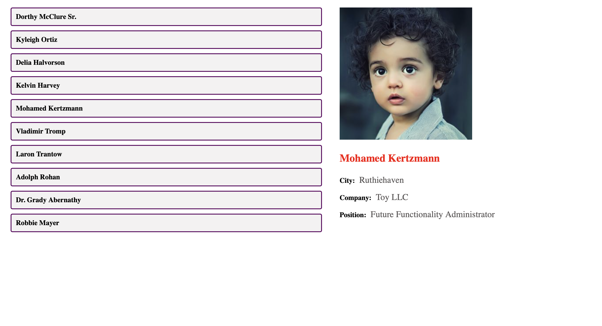

## Available Scripts

In the project directory, you can run:

### `npm start`
### `npm test`
### `npm run build`

# User Profile Viewer

## Project Description

We send a fetch request to the server to get a list of users.

The page displays a list of users, and when clicking on any user, detailed information about that user is shown.

When clicking on the same user again, the request is not sent repeatedly.

## Technologies Used

- React
- JavaScript
- useState
- useEffect
- Fetch API
- CSS
